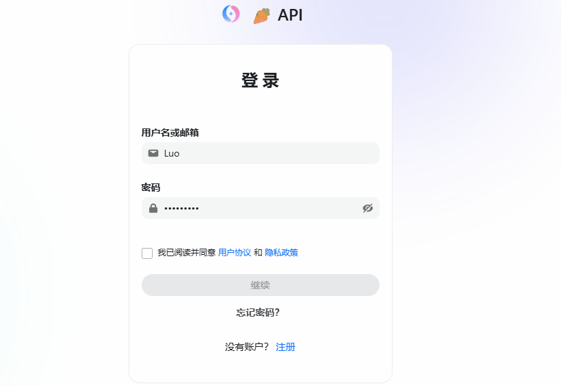
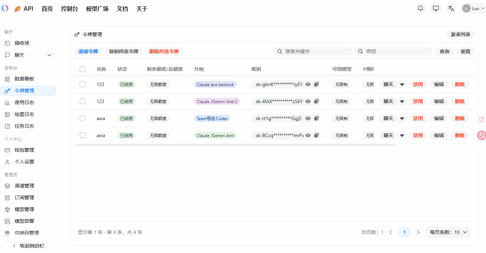
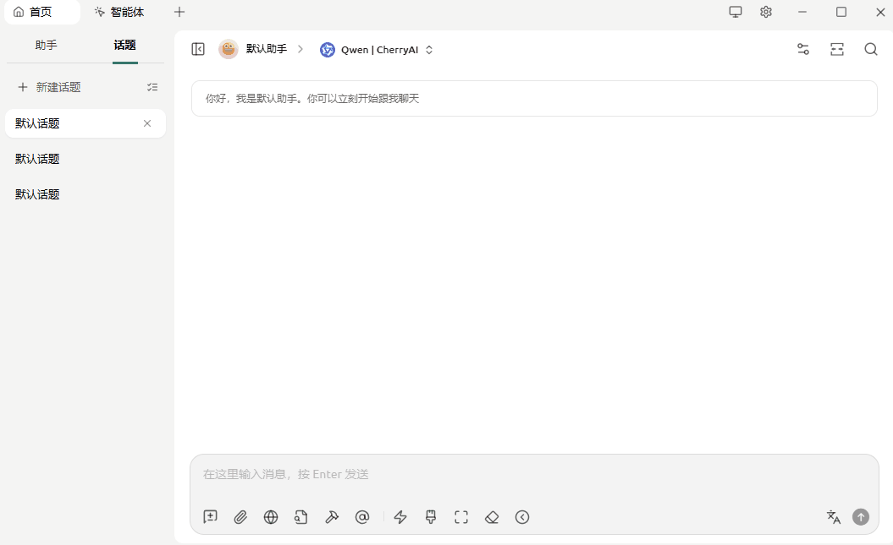

站点使用教程（网页版聊天 + 客户端配置）

<div style="margin: 12px 0 16px; padding: 14px 16px; border: 2px solid #ff4d4f; border-radius: 10px; background: #fff1f0;">
  <p style="margin: 0 0 8px; color: #cf1322; font-size: 20px; font-weight: 700;">🔥 QQ 交流群：1082916395</p>
  <p style="margin: 0 0 8px; color: #cf1322; font-weight: 600;">🔗 加群链接：<a href="https://qm.qq.com/q/KeuCKEMzim">https://qm.qq.com/q/KeuCKEMzim</a></p>
  <p style="margin: 0; color: #cf1322; font-weight: 600;">💬 建议先加群：很多时候平台通知不一定能及时送达，发货通知、维护通知、模型变动通知都会更方便同步；不会配置、遇到报错也可以直接进群咨询</p>
</div>

本文适用于站点：<https://newapi.20200626.xyz>

如果你只是想直接聊天，**优先使用站内网页版聊天**：不需要下载第三方客户端，也不需要自己创建和填写 API Key。

如果你后续需要把本站接入 Cherry Studio、ChatBox、Cursor、酒馆、CLI 等工具，再看后面的客户端配置部分即可。

如果你还没决定用哪种方式：

- **只想直接聊天**：首推站内网页版聊天
- **需要第三方客户端**：首推 Cherry Studio

常用页面：

- 网页聊天：<https://newapi.20200626.xyz/chat>
- 控制台地址：<https://newapi.20200626.xyz/console>
- 登录页：<https://newapi.20200626.xyz/login>
- 令牌管理：<https://newapi.20200626.xyz/console/token>
- 模型价格页：<https://newapi.20200626.xyz/pricing>

---

## 一、先用网页版聊天（推荐新手首选）

如果你只是想正常聊天，不折腾第三方客户端，直接用网页版就够了。

### 入口

- 网页聊天：<https://newapi.20200626.xyz/chat>
- 登录页：<https://newapi.20200626.xyz/login>

### 使用步骤

1. 先登录你的站点账号，没有账号就先注册或联系管理员开通。
2. 打开网页版聊天：<https://newapi.20200626.xyz/chat>
3. 进入页面后，先选择**分组**和**模型**。
4. 直接开始对话即可，当前也支持**聊天历史**和**图片上传**。

### 网页版聊天的特点

- **不需要 API Key**
- **不需要下载 Cherry Studio、ChatBox 等第三方客户端**
- **直接使用当前登录账号的模型权限和账户额度**
- **聊天历史保存在当前浏览器 / 当前设备内**
- 如果后续需要接入 Cursor、Cherry Studio、酒馆、CLI 或自己写程序调用 API，再去创建令牌即可

> 注意：网页版聊天记录当前按“当前浏览器 + 当前设备 + 当前账号”保存。换浏览器、换手机、换电脑后，不会自动同步之前这台设备上的本地聊天历史。

---

## 二、如需第三方客户端，再准备好 3 个信息

在接入任何客户端前，你只需要准备下面 3 项：

1. **站点地址**
   - `https://newapi.20200626.xyz`
2. **OpenAI Base URL**
   - `https://newapi.20200626.xyz/v1`
3. **API Key**
   - 在令牌管理页面创建并复制
   - 完整密钥格式为：`sk-xxxxxxxx`

> 大多数客户端只要填好 `Base URL + API Key + 模型名称` 就能直接使用。

---

## 三、创建 API Key（令牌）

> 只有在你要接入第三方客户端、插件、IDE、酒馆或自己调用 API 时，才需要创建 API Key。  
> 如果你只是使用网页版聊天，可以直接跳过这一节。

### 1）登录站点

- 登录页：<https://newapi.20200626.xyz/login>
- 如果你还没有账号，请先注册或联系管理员开通账号。
- 如果你已经购买了额度，请先到额度兑换页面完成兑换：<https://newapi.20200626.xyz/console/topup>



### 2）打开令牌管理

进入：

- <https://newapi.20200626.xyz/console/token>

### 3）点击“新建”创建令牌

创建时建议这样填写：

- **名称**：随意，方便自己区分即可
- **令牌分组**：按你的实际使用选择
- **过期时间**：按需设置，可先留空
- **额度**：按需设置
- **模型限制列表**：如果没有特殊需求，建议先留空
- **IP 白名单**：没有特殊需求可先留空



### 4）创建完成后复制密钥

创建成功后，在令牌列表中点击复制，拿到完整的：

```text
sk-xxxxxxxxxxxxxxxx
```

后面所有客户端都填写这个完整 key。

---

## 四、怎么看分组、模型和价格

模型与价格页：

- <https://newapi.20200626.xyz/pricing>

如果你不知道该选哪个模型、哪个分组，先看价格页就行。

### 1）先看分组

在本站里，**分组**就是不同的使用线路。

- 同一个模型可能出现在多个分组里
- 不同分组，价格可能不一样
- 不同分组，能力也可能不一样

所以看价格时，**一定要连分组一起看**。

### 2）再看计费方式

- **按次计费**：用一次扣一次，页面会直接写每次多少钱
- **按量计费**：按 Token 结算，主要看输入价和输出价

在本站里，很多带 `-c` 的模型通常是按次模型。  
但最稳妥的办法，还是直接看价格页里的**计费类型**。

### 3）最后看价格

- 想看最准确的价格：**先选分组，再看模型**
- 如果分组选的是“全部”，页面显示的是方便你比较的预览价格
- 真正扣费，还是按你实际使用的分组来算

### 4）不会选怎么办

如果你是第一次使用，推荐这样看：

1. 先去价格页看你账号当前能用哪些模型
2. 先确定你要的是聊天、代码、绘图还是长上下文
3. 再看这个模型在哪些分组能用
4. 对比价格后再选

如果你后面要接第三方客户端，**模型名称建议直接自动获取或者从价格页复制**，不要自己手动输入。

> 实际可用模型、可用分组和最终价格，请以你当前账号页面显示为准。

---

## 五、通用填写说明

### 1）客户端填写 Base URL 时

如果客户端写的是 **OpenAI / OpenAI Compatible / OpenAI API / 自定义 OpenAI**，就填：

```text
https://newapi.20200626.xyz/v1
```

### 2）客户端填写站点主页时

如果客户端写的是 **站点地址 / 服务商主页 / Homepage**，就填：

```text
https://newapi.20200626.xyz
```

### 3）模型列表拉取失败时

如果客户端支持自动拉取模型列表但拉取失败，直接手动填模型 ID 即可。

### 4）API Key 的填写方式

API Key 一律填写你创建的完整密钥：

```text
sk-xxxxxxxxxxxxxxxx
```

---

## 六、常见客户端接入

### 1）Cherry Studio（首推）

**如果你明确需要第三方客户端，优先推荐 Cherry Studio**。

- 界面直观，适合新手
- 配置简单，上手快
- 日常对话、模型切换都比较方便
- 配置简单，推荐直接手动填写

#### 下载地址

- 官网下载：<https://www.cherry-ai.com>

#### 首次打开时先选对接入方式

> **重要提醒：** Cherry Studio 安装完成后，首次打开会优先展示 **Cherry Studio 自己的收费服务**。  
> 如果你是要接入本站，请不要选它自带的付费方案，**而是选择「第三方 API」相关方式** 再继续配置。

#### 配置方式：手动填写

在 Cherry Studio 中推荐使用 **OpenAI 兼容**方式接入：

- 提供商：`OpenAI` 或 `OpenAI Compatible`
- API地址（Base URL）：`https://newapi.20200626.xyz/v1`
- API Key：你的 `sk-...`
- 模型：点击获取模型列表



> **重要提醒：** 配置保存完成后，回到聊天界面时，**记得切换到你刚刚配置好的模型**。  
> 很多人已经成功配置了接口，但聊天时仍停留在原来的默认模型，结果看起来像是“没有配成功”。

#### Cherry Studio 常见说明

- 如果拉取不到模型列表，直接去 <https://newapi.20200626.xyz/pricing> 复制模型名
- 如果首次打开时弹出了 Cherry Studio 官方付费服务页面，请返回并选择 **第三方 API / OpenAI Compatible**，不要选错入口
- 如果界面里写的是 `API Host`、`Base URL`、`OpenAI API 地址`，本质上都填同一个地址：`https://newapi.20200626.xyz/v1`
- 初次接入建议先选一个常用模型测试，确认连通后再切换正式模型
- 如果你已经手动配置成功，但聊天还是不对，请先检查聊天界面当前选中的模型是不是你刚配置的那个

---

### 2）ChatBox（电脑 / 安卓 / iPhone / iPad）

- ChatBox 官网：<https://chatboxai.app/zh>
- ChatBox 提供桌面端，也有 **Android / iOS / iPadOS** 客户端
- 不同平台界面会有一点区别，但核心填写内容完全一样

#### 桌面端配置

在 ChatBox 中添加自定义 OpenAI 服务商：

- API Host / Base URL：`https://newapi.20200626.xyz/v1`
- API Key：你的 `sk-...`
- 模型：手动选择或填写模型 ID

推荐先用一个简单模型测试，确认连通后再切换常用模型。

#### 手机端配置（安卓 / 苹果）

1. 先从 ChatBox 官网下载，或按官网指引前往应用商店安装  
   <https://chatboxai.app/zh>
2. 打开 ChatBox App，进入 **设置 / 模型提供商 / API 提供商** 相关页面
3. 选择 **OpenAI** 或 **自定义 OpenAI 兼容接口**
4. 按下面内容填写：
   - API Host / Base URL：`https://newapi.20200626.xyz/v1`
   - API Key：你的 `sk-...`
   - 模型：自动获取或者手动填写你要使用的模型名
5. 保存后新建对话，先用一个简单问题测试是否连接成功

#### 手机端常见说明

- 如果手机端拉取不到模型列表，直接去 <https://newapi.20200626.xyz/pricing> 复制模型名手动填写即可
- 如果你看到的是 `API Host`、`Base URL`、`OpenAI API 地址` 之类名称，填的都是同一个地址：`https://newapi.20200626.xyz/v1`
- 部分版本入口名称可能略有不同，但只要找到 **OpenAI / OpenAI Compatible / 自定义接口** 相关设置即可

---

### 3）VS Code / Cursor（Cline、Roo Code、Kilo Code）

这类插件建议统一按 **OpenAI Compatible** 配置：

- Provider：`OpenAI Compatible`
- Base URL：`https://newapi.20200626.xyz/v1`
- API Key：你的 `sk-...`
- Model：例如 `gpt-5.4`、`gpt-5.3-codex`

如果插件支持“获取模型列表”，可以先尝试拉取；拉取不到时，直接手动填模型 ID。

---

### 4）酒馆（SillyTavern）

酒馆推荐使用 **Chat Completion + Custom (OpenAI-compatible)** 方式接入。

请按以下内容填写：

- API / Source：`Chat Completion`
- Chat Completion Source：`Custom (OpenAI-compatible)`
- API URL / Endpoint：

```text
https://newapi.20200626.xyz/v1
```

- API Key：

```text
sk-你的密钥
```

- Model：手动填写或下拉选择

> 注意：地址填写 `https://newapi.20200626.xyz/v1` 即可，不要手动再加 `/chat/completions`

#### 酒馆推荐模型

使用酒馆的大多数用户更常用 **按次模型**，建议优先选择带 `-c` 后缀的模型，例如：

- `gemini-3.1-pro-high-c`
- `gemini-3.1-pro-low-c`
- `gemini-3-flash-c`
- `claude-sonnet-4-6-c`

#### 酒馆常见问题

- **连不上 / 报错**
  - 先确认你填的是 `https://newapi.20200626.xyz/v1`
  - 不要填成 `https://newapi.20200626.xyz/v1/chat/completions`
- **看不到模型列表**
  - 直接去 <https://newapi.20200626.xyz/pricing> 复制模型名手动填
- **想控制成本**
  - 优先选择带 `-c` 后缀的按次模型

---

### 5）CC Switch（Claude / Codex / Gemini）

本站已支持 **CC Switch** 快捷导入。

你可以在 **令牌管理** 页面，对应令牌右侧点击：

- **聊天**
- 或聊天按钮下拉菜单中的 **CC Switch**

然后按页面提示选择：

- 应用：`Claude` / `Codex` / `Gemini`
- 名称：随意
- 主模型：按需选择

#### 手动填写

- **Codex**
  - Endpoint：`https://newapi.20200626.xyz/v1`
- **Claude / Gemini**
  - Endpoint：`https://newapi.20200626.xyz`
- API Key：
  - 你的 `sk-...`
- Homepage：
  - `https://newapi.20200626.xyz`

> 如无特殊需求，优先使用站内一键导入，更省事也不容易填错。

---

### 6）Claude Code / Codex / Gemini CLI（下载安装）

如果需要在本地使用 **Claude Code、Codex、Gemini CLI**，建议按下面方式安装。

#### 通用准备

- Node.js 官网：<https://nodejs.org/en/download>
- CC Switch 下载地址：<https://github.com/farion1231/cc-switch/releases>

#### 通用步骤

1. 先安装 **Node.js**
2. 根据你要使用的客户端，执行对应安装命令
3. 下载并安装 **CC Switch**
4. 打开本站 **令牌管理**
5. 找到对应令牌，点击 **聊天** -> **CC Switch**
6. 在弹窗里选择对应应用和模型
7. 打开 CC Switch，启用刚导入的配置
8. 重启终端后再执行对应命令启动

#### Claude Code

- 官方文档：<https://docs.anthropic.com/en/docs/claude-code/getting-started>
- 安装命令：

```bash
npm install -g @anthropic-ai/claude-code
```

- CC Switch 中选择：
  - 应用：`Claude`
  - 主模型：按需选择
- 启动命令：

```bash
claude
```

#### Codex

- 官方仓库：<https://github.com/openai/codex>
- 官方帮助文档：<https://help.openai.com/en/articles/11096431-openai-codex-ci-getting-started>
- 安装命令：

```bash
npm install -g @openai/codex
```

- CC Switch 中选择：
  - 应用：`Codex`
  - 主模型：例如 `gpt-5.3-codex`、`gpt-5.4`
- 启动命令：

```bash
codex
```

> OpenAI 官方文档说明 Codex 官方主要支持 macOS 和 Linux，Windows 可能需要 WSL。

#### Gemini CLI

- 官方仓库：<https://github.com/google-gemini/gemini-cli>
- 安装命令：

```bash
npm install -g @google/gemini-cli
```

- CC Switch 中选择：
  - 应用：`Gemini`
  - 主模型：例如 `gemini-3.1-pro-high-c`、`gemini-3-flash-c`
- 启动命令：

```bash
gemini
```

> Gemini CLI 官方说明要求较新的 Node.js 版本，安装最新版 LTS 即可。

#### 补充说明

- 如果命令执行后提示找不到 `claude`、`codex` 或 `gemini`，请先重开终端再试
- 如无特殊需求，优先使用 CC Switch 导入，不建议手动改配置文件

---

### 7）站内一键导入

当前已支持的一键导入目标包括：

- Cherry Studio
- AionUI
- 流畅阅读
- CC Switch
- Lobe Chat 官方示例
- AI as Workspace
- AMA 问天
- OpenCat

使用方法：

1. 进入令牌管理
2. 找到你的令牌
3. 点击右侧 **聊天**
4. 选择目标客户端
5. 按提示完成导入

---

## 七、接口测试

如果需要先测试接口是否正常，可直接执行下面的请求：

```bash
curl https://newapi.20200626.xyz/v1/chat/completions ^
  -H "Content-Type: application/json" ^
  -H "Authorization: Bearer sk-你的密钥" ^
  -d "{\"model\":\"gpt-5.4\",\"messages\":[{\"role\":\"user\",\"content\":\"你好，做个自我介绍\"}]}"
```

如果你在 Linux 或 macOS 终端中执行，把 `^` 改成 `\` 即可。

---

## 八、常见问题

### 1）我只是网页聊天，也要创建 API Key 吗？

不需要。

只要登录账号后打开：<https://newapi.20200626.xyz/chat>  
就可以直接使用当前账号的额度和模型权限进行网页对话。

### 2）为什么我换了浏览器 / 手机 / 电脑后，看不到之前的网页聊天记录？

因为网页版聊天记录当前保存在**当前浏览器 / 当前设备**里。

也就是说：

- 同一账号在当前浏览器里能看到之前记录
- 换浏览器、换手机、换电脑后，不会自动带过去

### 3）为什么报 401？

通常是下面几种原因：

- API Key 填错
- 没有带 `sk-` 前缀
- 令牌已禁用或已过期
- 请求头没有使用 `Authorization: Bearer sk-...`

### 4）为什么报 404？

最常见原因是地址填错了，尤其是少了 `/v1`。

OpenAI 兼容客户端请优先填写：

```text
https://newapi.20200626.xyz/v1
```

### 5）为什么看不到模型？

- 某些客户端不会自动拉取模型列表
- 某些模型受令牌分组限制
- 直接去 `/pricing` 页面复制模型名手动填写即可

### 6）为什么报 429？

表示请求过快，触发了频率限制。  
请降低并发、减少短时间重复请求，或更换模型再试。

### 7）为什么报 403？

一般表示：

- 当前分组不允许该模型
- 额度不足
- 模型权限不足

### 8）为什么同一个问题扣费比想象中快？

常见原因：

- 使用了高倍率模型
- 客户端自动多轮调用
- 上下文太长
- 开启了 Agent / 工具调用 / 长上下文模式

建议先用便宜模型测试，稳定后再切主模型。

---

## 九、推荐使用顺序

如果你是第一次使用，建议按这个顺序：

1. 先登录站点，直接使用网页版聊天：<https://newapi.20200626.xyz/chat>
2. 去 `/pricing` 查看自己可用的模型和价格
3. 如果只是日常聊天，继续用网页版即可
4. 只有在你需要第三方客户端或程序调用时，再去创建令牌
5. 需要第三方客户端时，**优先使用 Cherry Studio**
6. 如需排查 API 连通性，再用上面的 `curl` 做最小测试
7. 需要 VS Code / Cursor / 酒馆 / CLI 工作流时，再接入对应客户端

如果你只想选一个最省事的使用方式，**优先直接用网页版聊天**。  
如果你只想选一个第三方客户端，**就选 Cherry Studio**。
